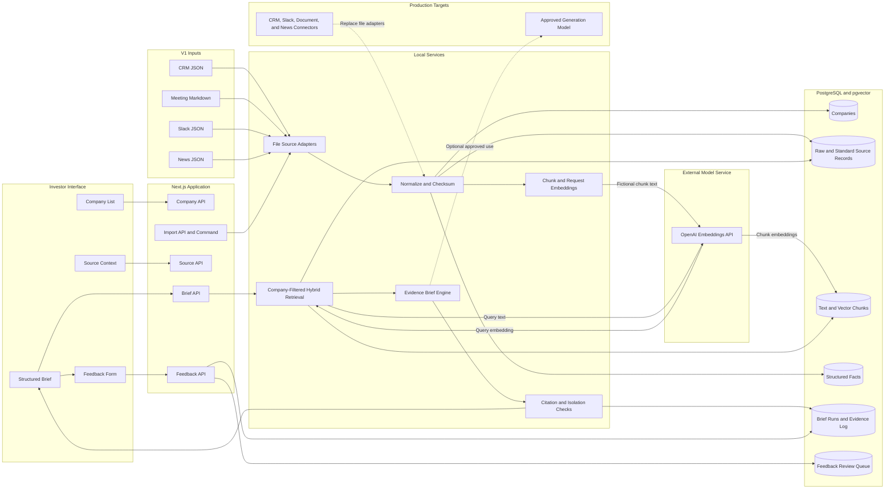

# Portfolio Intelligence Architecture

## Purpose

This architecture supports the V1 company briefing flow. It keeps evidence for each company separate. It also preserves the original source record.

## Import Flow

1. A file adapter reads one source format.
2. The import process checks the record structure.
3. The import process assigns one known company ID.
4. The import process keeps the original record.
5. The import process creates standard source text.
6. The import process records each source date and access value.
7. The import process calculates a content checksum.
8. The import process divides long text into chunks.
9. The import process sends each fictional text chunk to the OpenAI Embeddings API.
10. The API creates a 1,536-value embedding with `text-embedding-3-large`.
11. The import process writes the data and embedding to PostgreSQL.

The checksum makes the import idempotent. An import does not change a record when its checksum is the same. It does not request embeddings for unchanged chunks. An import replaces the chunks, facts, and embeddings when the source record changes.

## Brief Flow

1. RC selects a known company.
2. The retrieval service sends the fixed query text to the OpenAI Embeddings API.
3. The API returns a query embedding.
4. The database applies a hard company filter.
5. The retrieval service searches full text and stored embeddings.
6. The retrieval service ranks evidence by search match, source quality, and date.
7. The brief engine creates the required sections with fixed local rules.
8. The citation check confirms each source ID.
9. The isolation check confirms each evidence record has the selected company ID.
10. The application records the retrieval input, evidence set, result, and time.
11. The interface shows a compact brief.
12. RC opens one statement to see its values, evidence role, and source excerpts.
13. The source API checks the selected company ID before it returns source detail.
14. RC opens one source to see the stored source content, dates, location, structured facts, and original record.
15. The Brief API returns the identifier for the saved brief.
16. RC can mark the full brief or one statement as `Good`, `Bad`, or `Wrong`.
17. The Feedback API checks the company and saved brief.
18. The Feedback API copies the saved statement text and source IDs into the review item.
19. The server sets the priority and opens the review item.

When a newer verified value exists, the main fact is confirmed. The older source remains in Evidence with the `Earlier value` role. The state engine uses `Update needed` only when every available source is marked as old. A current source removes this warning.

## Retrieval Rank

V1 uses this rank:

- 38 percent PostgreSQL full-text rank
- 32 percent embedding similarity
- 20 percent source quality
- 10 percent source date

The company filter runs before this rank. The database does not use an approximate vector index. Exact vector search is sufficient for the V1 data size.

## Main Tables

| Table | Purpose |
| --- | --- |
| `companies` | Stores the known company and relationship data. |
| `source_records` | Stores original records, standard text, dates, access values, and checksums. |
| `document_chunks` | Stores company-scoped text chunks, search text, and embeddings. |
| `facts` | Stores structured values that can have conflicts. |
| `brief_runs` | Stores each brief result, request, mode, and time. |
| `brief_evidence` | Stores the exact source records and ranks for each brief. |
| `brief_feedback` | Stores full-brief and statement feedback for review and resolution. |

## Feedback Review Boundary

The end-user API can only create feedback. It cannot set priority, status, reviewer names, or resolution text. The server maps `Good` to low priority, `Bad` to normal priority, and `Wrong` to high priority. All new items have the `open` status.

Each feedback item uses the saved brief ID and company ID together. This rule prevents feedback from one company from linking to a brief for another company. A statement item stores the statement text and source IDs from the saved brief. It does not trust text from the browser.

V1 does not include a reviewer interface because it does not include trusted reviewer identity. A later reviewer API must check the reviewer identity and company access before it can read or update the queue.

## Source Integration Boundary

V1 uses files that represent source exports. A production source adapter must create the same standard source record.

A production adapter must add these functions:

- Source authentication
- Incremental imports
- Scheduled comparisons
- Change notifications
- Deleted-record handling
- Source access rules
- Error monitoring

A webhook can start an import. It must not become the source of truth. A scheduled comparison must find missed changes.

## Data Protection

V1 sends fictional chunk text and query text to the OpenAI Embeddings API. It does not send raw JSON records or generated briefs. PostgreSQL stores and searches the embeddings on the local computer.

The repository does not contain credentials. `.env.local` is excluded from Git.

The brief engine uses fixed local rules. It does not call a generation model. An approved generation model can extend the brief engine later. The team must first define which source classes the model can receive. The team must also define retention, access, and audit controls.
