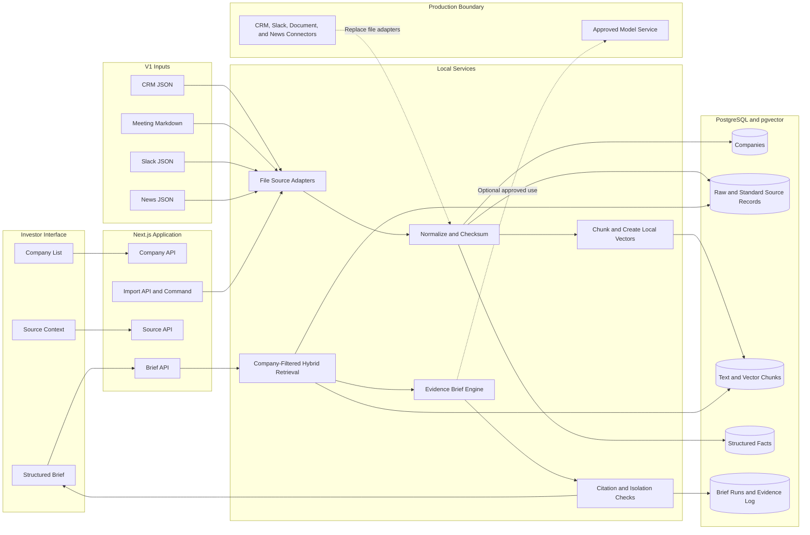

# Portfolio Intelligence Architecture

## Purpose

This architecture supports the V1 company briefing flow. It keeps evidence for each company separate. It also preserves the original source record.

## Import Flow

1. A file adapter reads one source format.
2. The import process checks the record structure.
3. The import process assigns one known company ID.
4. The import process keeps the original record.
5. The import process creates standard source text.
6. The import process records each source date and access value.
7. The import process calculates a content checksum.
8. The import process divides long text into chunks.
9. The import process creates a local 1536-value vector for each chunk.
10. The import process writes the data to PostgreSQL.

The checksum makes the import idempotent. An import does not change a record when its checksum is the same. An import replaces the chunks, facts, and vectors when the source record changes.

## Brief Flow

1. RC selects a known company.
2. The application applies a hard company filter.
3. The retrieval service searches text and vectors.
4. The retrieval service ranks evidence by search match, source quality, and date.
5. The brief engine creates the required sections.
6. The citation check confirms each source ID.
7. The isolation check confirms each evidence record has the selected company ID.
8. The application records the retrieval input, evidence set, result, and time.
9. The interface shows the brief and the source context.

## Retrieval Rank

V1 uses this rank:

- 38 percent PostgreSQL full-text rank
- 32 percent vector similarity
- 20 percent source quality
- 10 percent source date

The company filter runs before this rank. The database does not use an approximate vector index. Exact vector search is sufficient for the V1 data size.

## Main Tables

| Table | Purpose |
| --- | --- |
| `companies` | Stores the known company and relationship data. |
| `source_records` | Stores original records, standard text, dates, access values, and checksums. |
| `document_chunks` | Stores company-scoped text chunks, search text, and vectors. |
| `facts` | Stores structured values that can have conflicts. |
| `brief_runs` | Stores each brief result, request, mode, and time. |
| `brief_evidence` | Stores the exact source records and ranks for each brief. |

## Source Integration Boundary

V1 uses files that represent source exports. A production source adapter must create the same standard source record.

A production adapter must add these functions:

- Source authentication
- Incremental imports
- Scheduled comparisons
- Change notifications
- Deleted-record handling
- Source access rules
- Error monitoring

A webhook can start an import. It must not become the source of truth. A scheduled comparison must find missed changes.

## Data Protection

V1 keeps all source content and vector creation on the local computer. V1 does not send source records to an external model.

The repository does not contain credentials. `.env.local` is excluded from Git.

An approved model service can replace or extend the local brief engine later. The team must first define which source classes the model can receive. The team must also define retention, access, and audit controls.
