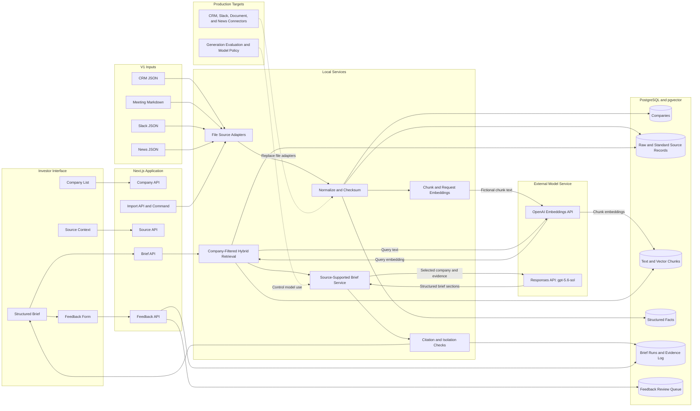

# Portfolio Intelligence Architecture

## Purpose

This architecture supports the V1 company briefing flow. It keeps evidence for each company separate. It also preserves the original source record.

## Import Flow

1. A file adapter reads one source format.
2. The import process checks the record structure.
3. The import process assigns one known company ID.
4. The import process keeps the original record.
5. The import process creates standard source text.
6. The import process records each source date and access value.
7. The import process calculates a content checksum.
8. The import process divides long text into chunks.
9. The import process sends each fictional text chunk to the OpenAI Embeddings API.
10. The API creates a 1,536-value embedding with `text-embedding-3-large`.
11. The import process writes the data and embedding to PostgreSQL.

The checksum makes the import idempotent. An import does not change a record when its checksum is the same. It does not request embeddings for unchanged chunks. An import replaces the chunks, facts, and embeddings when the source record changes.

## Brief Flow

1. RC opens the application or selects a known company.
2. The Brief API loads that company's latest saved brief.
3. The interface shows the saved brief without running retrieval or generation again.
4. If no saved brief exists, the application prepares and saves the first one.
5. RC selects `Refresh brief` to explicitly request a new brief.
6. The retrieval service sends the fixed query text to the OpenAI Embeddings API.
7. The API returns a query embedding.
8. The database applies a hard company filter.
9. The retrieval service searches full text and stored embeddings.
10. The retrieval service ranks evidence by search match, source quality, and date.
11. The brief service sends selected company data and retrieved evidence to `gpt-5.6-sol` through the Responses API.
12. The request uses low reasoning effort and a strict JSON schema.
13. The request uses no tools and sets `store: false`.
14. The model call has a 27-second timeout and no automatic retry. The full brief request has a 29-second budget.
15. The model returns the five required brief sections and an exact quote for each cited source.
16. The server confirms that each source ID is in the retrieved evidence set.
17. The server confirms that each quote occurs in its source.
18. The server checks factual statements against the content words in their quotes.
19. The server checks money, percentages, durations, dates, and counts against cited sources.
20. A value conflict must use two direct sources for the different values.
21. The server rejects investment recommendations.
22. The server makes sure that each source marked `unverified` appears as an unverified risk.
23. The server creates item IDs, dates, excerpts, values, and citation roles.
24. The citation check confirms each source ID.
25. The isolation check confirms each evidence record has the selected company ID.
26. A model error or invalid result starts the deterministic local fallback.
27. The application records the generation mode, model data, evidence set, result, and time.
28. The interface shows the new compact brief.
29. RC opens one statement to see its values, evidence role, and source excerpts.
30. The source API checks the selected company ID before it returns source detail.
31. RC opens one source to see the stored source content, dates, location, structured facts, and original record.
32. The Brief API returns the identifier for the saved brief.
33. RC can mark the full brief or one statement as `Good`, `Bad`, or `Wrong`.
34. The Feedback API checks the company and saved brief.
35. The Feedback API copies the saved statement text and source IDs into the review item.
36. The server sets the priority and opens the review item.

When a newer verified value exists, the main fact is confirmed. The older source remains in Evidence with the `Earlier value` role. The state engine uses `Update needed` only when every available source is marked as old. A current source removes this warning.

## Source-Supported Generation

The generation request contains only selected company data and retrieved evidence. Each evidence item contains the source ID, source type, title, date, verification status, and standard text. The request does not contain raw JSON, access data, or records for another company. The application treats source content as untrusted data.

A successful model result uses the `openai-grounded` mode. This mode means that the brief passed the source-support checks. The server validates the strict schema, source IDs, exact quotes, factual content words, typed values, conflicts, citations, company isolation, and investment-recommendation rule. The server uses source status to add a required unverified risk when the model omits it. The audit record stores the number of required signals that the server adds.

A failed validation starts the deterministic local builder. The fallback uses the `evidence-fallback` mode. The saved brief run stores a safe failure code. It does not store the raw model error or an invalid model result.

## Retrieval Rank

V1 uses this rank:

- 38 percent PostgreSQL full-text rank
- 32 percent embedding similarity
- 20 percent source quality
- 10 percent source date

The company filter runs before this rank. The database does not use an approximate vector index. Exact vector search is sufficient for the V1 data size.

## Main Tables

| Table | Purpose |
| --- | --- |
| `companies` | Stores the known company and relationship data. |
| `source_records` | Stores original records, standard text, dates, access values, and checksums. |
| `document_chunks` | Stores company-scoped text chunks, search text, and embeddings. |
| `facts` | Stores structured values that can have conflicts. |
| `brief_runs` | Stores each brief result, request, model audit data, mode, and time. |
| `brief_evidence` | Stores the exact source records and ranks for each brief. |
| `brief_feedback` | Stores full-brief and statement feedback for review and resolution. |

## Feedback Review Boundary

The end-user API can only create feedback. It cannot set priority, status, reviewer names, or resolution text. The server maps `Good` to low priority, `Bad` to normal priority, and `Wrong` to high priority. All new items have the `open` status.

Each feedback item uses the saved brief ID and company ID together. This rule prevents feedback from one company from linking to a brief for another company. A statement item stores the statement text and source IDs from the saved brief. It does not trust text from the browser.

V1 does not include a reviewer interface because it does not include trusted reviewer identity. A later reviewer API must check the reviewer identity and company access before it can read or update the queue.

## Source Integration Boundary

V1 uses files that represent source exports. A production source adapter must create the same standard source record.

A production adapter must add these functions:

- Source authentication
- Incremental imports
- Scheduled comparisons
- Change notifications
- Deleted-record handling
- Source access rules
- Error monitoring

A webhook can start an import. It must not become the source of truth. A scheduled comparison must find missed changes.

## Data Protection

V1 sends fictional chunk text, query text, selected company data, and retrieved evidence text to OpenAI. The Embeddings API creates search embeddings. The Responses API creates source-supported briefs. The generation request uses `store: false`. It does not use tools. It does not contain raw JSON records, access data, or records for another company.

The repository does not contain credentials. `.env.local` is excluded from Git.

The production team must approve source classes, retention, access, model policy, and audit controls before it uses real company data.
